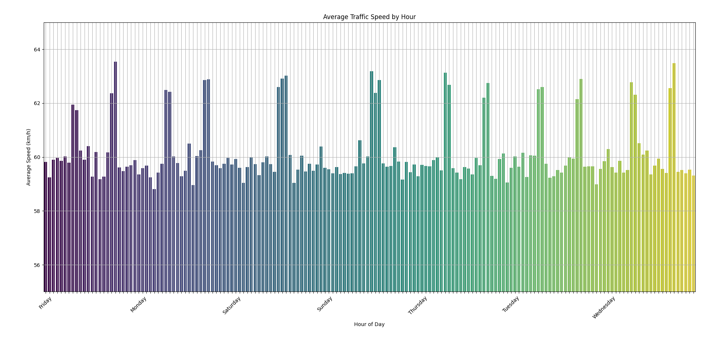
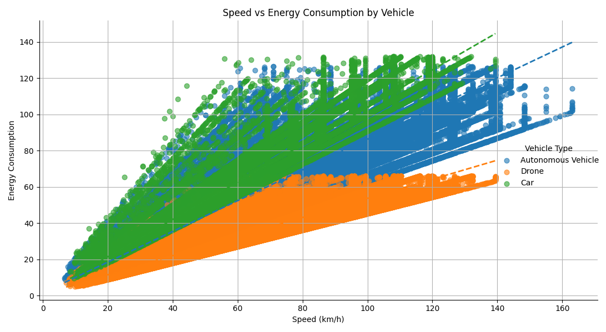
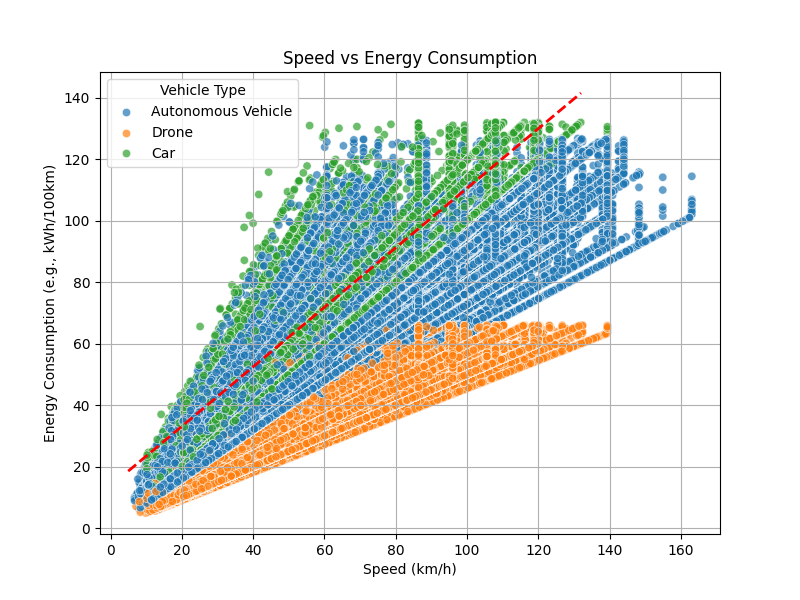
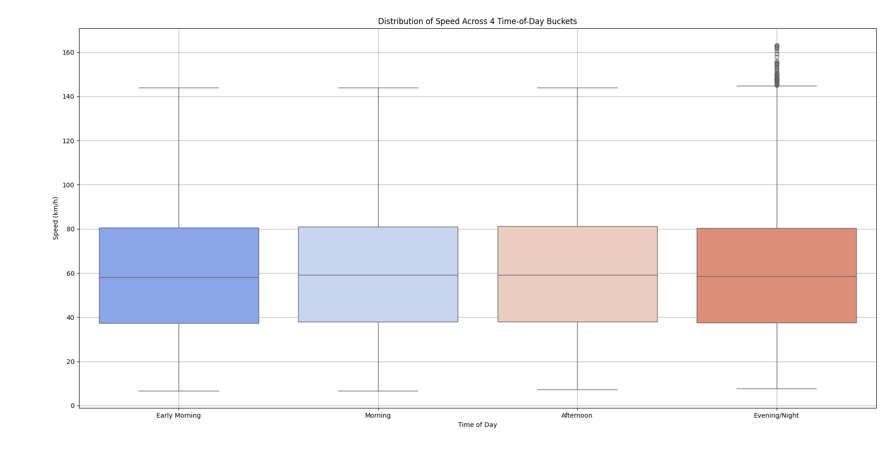
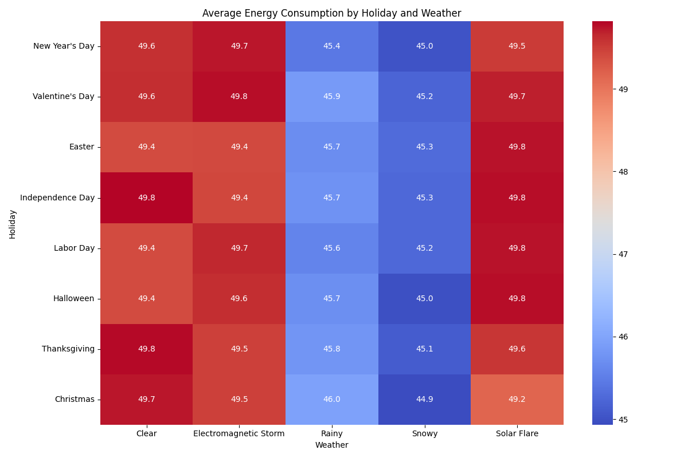

# Futuristic_Cities_traffic

**Echipa: Veveritele salbatice**  
Membrii:  
*Adrian Burla    
Bianca Mihaila  
Cosmin FLorescu*  

# Futuristic City Traffic Data Analysis

This dataset showcases an **exploratory data analysis** on a *futuristic city traffic* dataset from [Kaggle](https://www.kaggle.com/datasets/tanishqdublish/urban-traffic-density-in-cities). The dataset simulates modern urban traffic conditions, including various **vehicle types**, **weather conditions**, and **economic scenarios**. We showcase data cleaning, aggregation, and visualization techniques using **Python**.

## Dataset Overview

The dataset contains the following columns:

- **City**  
  Name of the city where traffic is recorded.

- **Vehicle Type**  
  Type of vehicle (e.g., *Car*, *Bus*, *Truck*, or *Flying Car* – the latter is removed as unrealistic).

- **Weather**  
  Weather conditions (e.g., *Clear*, *Rainy*, *Snowy*, *Electromagnetic Storm*).

- **Economic Condition**  
  Indicator of the economic scenario affecting traffic (e.g., *Recession*, *Boom*).

- **Day Of Week**  
  The day the record was logged (Monday through Sunday).

- **Hour Of Day**  
  The hour (in 24-hour format) when the data was collected.

- **Speed**  
  Traffic speed measured in km/h.

- **Is Peak Hour**  
  Boolean indicating if the data was recorded during peak traffic hours.

- **Random Event Occurred**  
  Whether an unexpected event (like an accident) occurred.

- **Energy Consumption**  
  Metric signifying energy usage (e.g., *kWh/100km*).

- **Traffic (Traffic Density)**  
  Represents traffic volume/density.

---

## Aggregation & Analysis

Once data is cleaned, we use groupby and agg methods to summarize the dataset and extract meaningful insights.

**Aggregation by Day Of Week:**
*Computes mean, max, and min Speed plus mean and total Traffic Density for each day.*

    
    if 'Day Of Week' in df_clean.columns:
    day_summary = df_clean.groupby('Day Of Week').agg({
        'Speed': ['mean', 'max', 'min'],
        'Traffic Density': ['mean', 'sum']
    })
    print("\nDay Of Week Summary (Speed and Traffic Density):")
    print(day_summary)

**Aggregation by Peak Hours:**
*Compares Speed, Energy Consumption, and Traffic Density between peak and non-peak hours.*

    
    if 'Is Peak Hour' in df_clean.columns:
    peak_summary = df_clean.groupby('Is Peak Hour').agg({
        'Speed': ['mean', 'max', 'min'],
        'Energy Consumption': 'mean',
        'Traffic Density': 'mean'
    })
    print("\nPeak Hour Summary (Speed, Energy Consumption, Traffic Density):")
    print(peak_summary)

## Statistics

   #### *plotting speed against time of day in a week*  

  #### *Speed vs. Energy Consumption along with a general trend line (red dashed line)*  

  #### *Here, we add a vehicle-specific component. The plot uses an lmplot to draw separate trend lines for each vehicle type.*  

  #### *This creates a box plot to show the distribution of Speed across 4 time-of-day buckets.*  
  

  #### *table of average energy consumption by combining weather conditions and holiday offsets*  

